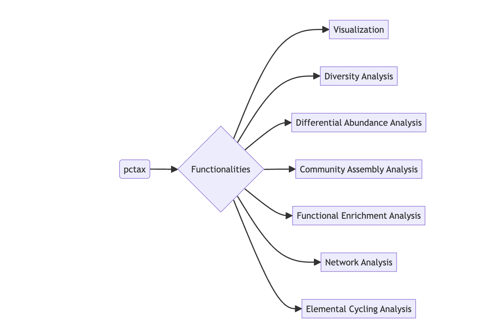

<!-- README.md is generated from README.Rmd. Please edit that file -->


```{r, include = FALSE}
knitr::opts_chunk$set(
  collapse = TRUE,
  comment = "#>",
  fig.path = "man/figures/README-",
  out.width = "100%"
)
devtools::load_all("~/Documents/R/pctax/pctax/")
library(pcutils)
library(badger)
```

# pctax 

<!-- badges: start -->
[](https://github.com/Asa12138/pctax/actions/workflows/R-CMD-check.yaml)
`r badge_custom("blog", "@asa", "blue", "https://asa-blog.netlify.app/")`
`r badge_cran_download("pctax", type = "grand-total")`
`r badge_cran_download("pctax", type = "last-month")`
`r badge_cran_release("pctax", "green")`
`r badge_devel("Asa12138/pctax", color = "green")`

<!-- badges: end -->

`pctax` provides a comprehensive suite of tools for analyzing omics data.

The HTML documentation of the latest version is available at [Github page](https://asa12138.github.io/pctax/).

Please go to <https://bookdown.org/Asa12138/pctax_book/> for the full vignette.

## Installation

The stable version is available on CRAN:

```
install.packages("pctax")
```

Or you can install the development version of pctax from [GitHub](https://github.com/) with:

``` r
# install.packages("devtools")
devtools::install_github("Asa12138/pctax")
```

## 🚀 NEWS 🚀

Recently, I added a function to draw two trees and their relationships:

```{r fig.width = 9, fig.height = 5, fig.cap = "Two trees and their relationships", cache = FALSE}
data(otutab, package = "pcutils")
df2tree(taxonomy[1:50, ]) -> tax_tree
df2tree(taxonomy[51:100, ]) -> tax_tree2
link <- data.frame(from = sample(tax_tree$tip.label, 20), to = sample(tax_tree2$tip.label, 20))
plot_two_tree(tax_tree, tax_tree2, link,
  tree1_tip = T, tree2_tip = T,
  tip1_param = list(size = 2), tip2_param = list(size = 2)
)
```


Recently I added a function to plot element cycling because element cycling genes are important in the microbiome (especially the environmental microbiome). Supports simple cycle diagram drawing of C, N, P, S, Fe (manual arrangement, there must be some missing parts, will be continuously added in the future):

```{r fig.width = 12, fig.height = 10, fig.cap = "Nitrogen cycle", cache = FALSE}
plot_element_cycle(cycle = "Nitrogen cycle")
```

## Usage

For the full vignette, please visit [pctax: Analyzing Omics Data with R](https://bookdown.org/Asa12138/pctax_book/).

**Some Functionalities of `pctax`:**

```{r include=FALSE,eval=FALSE}
DiagrammeR::DiagrammeR(diagram = "flowchart LR
    B(pctax)--> C{Functionalities}
    C --> D[Visualization]
    C --> E[Diversity Analysis]
    C --> F[Differential Abundance Analysis]
    C --> G[Community Assembly Analysis]
    C --> H[Functional Enrichment Analysis]
    C --> I[Network Analysis]
    C --> J[Elemental Cycling Analysis]")
```



## Citation
Please cite:

Chen Peng, Chao Jiang (2023). _pctax: Professional Comprehensive Microbiome Data Analysis Pipeline_. R package, <https://github.com/Asa12138/pctax>.

```{r include=FALSE,eval=FALSE}
library(hexSticker)
showtext::showtext_auto()
sticker("~/Documents/R/test/icons/enrichment.png",
  package = "ReporterScore",
  p_size = 17, p_color = "#0C359E", p_y = 1.4,
  p_fontface = "bold.italic", p_family = "Comic Sans MS",
  s_x = 1, s_y = .75, s_width = 0.6, s_height = 0.6,
  h_fill = "#F6F5F5", h_color = "#2D9596",
  filename = "man/figures/ReporterScore.png", dpi = 300
)
```
