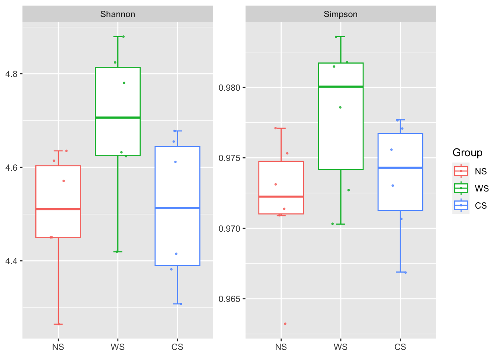
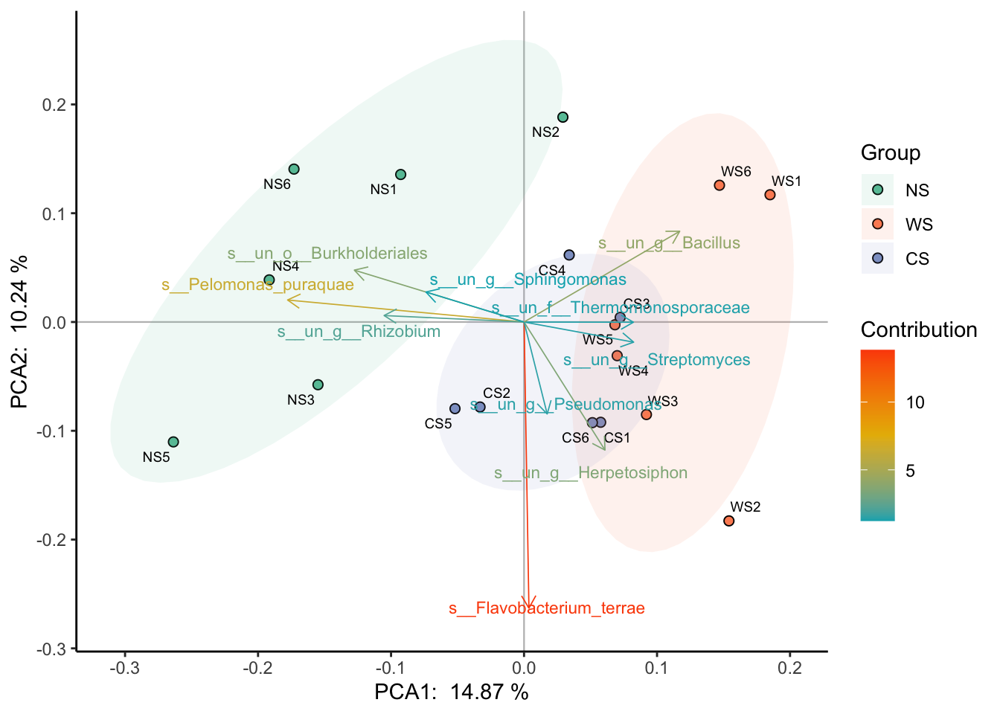
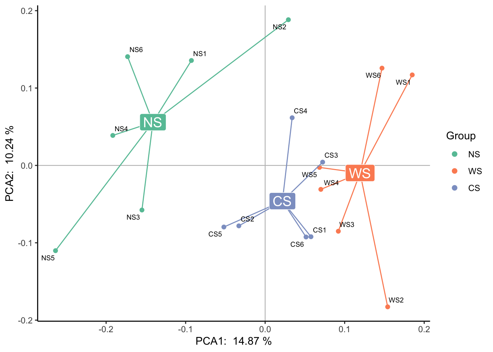
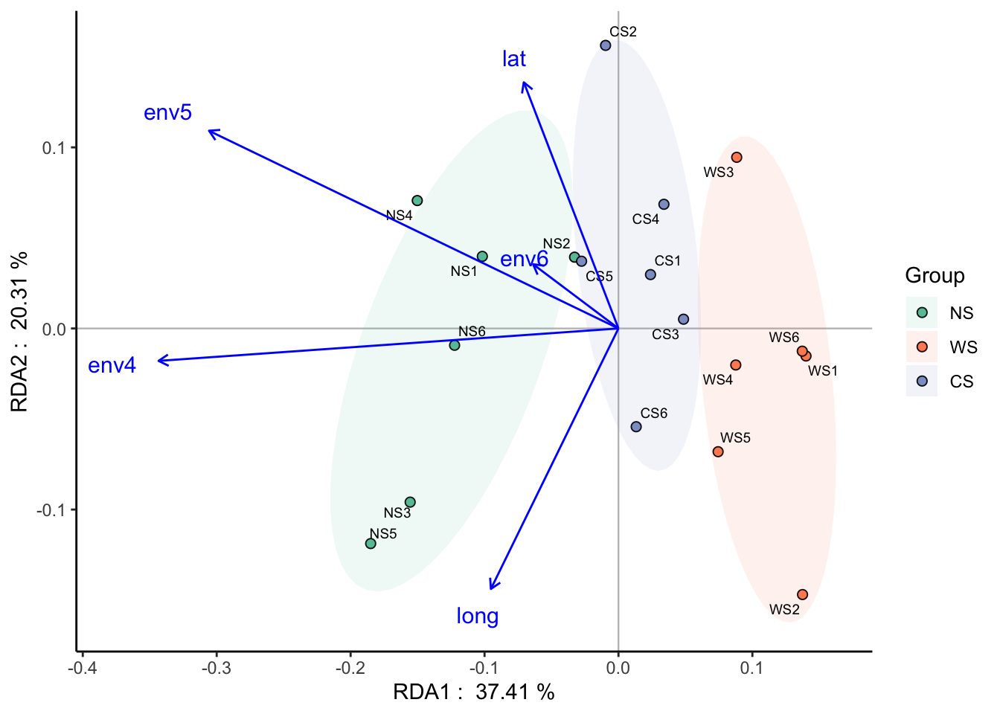
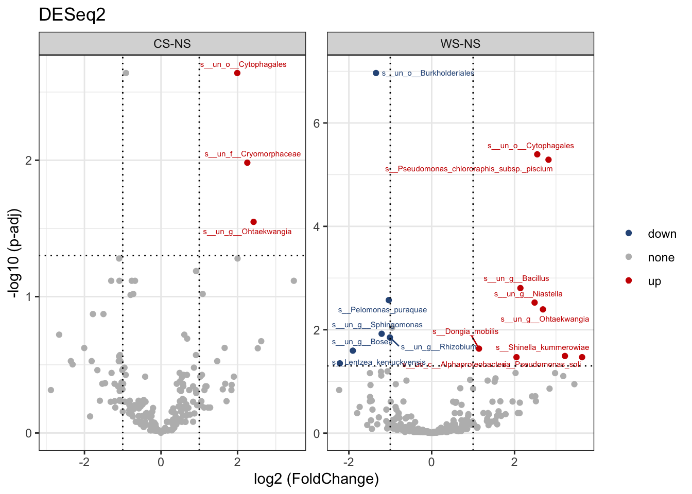
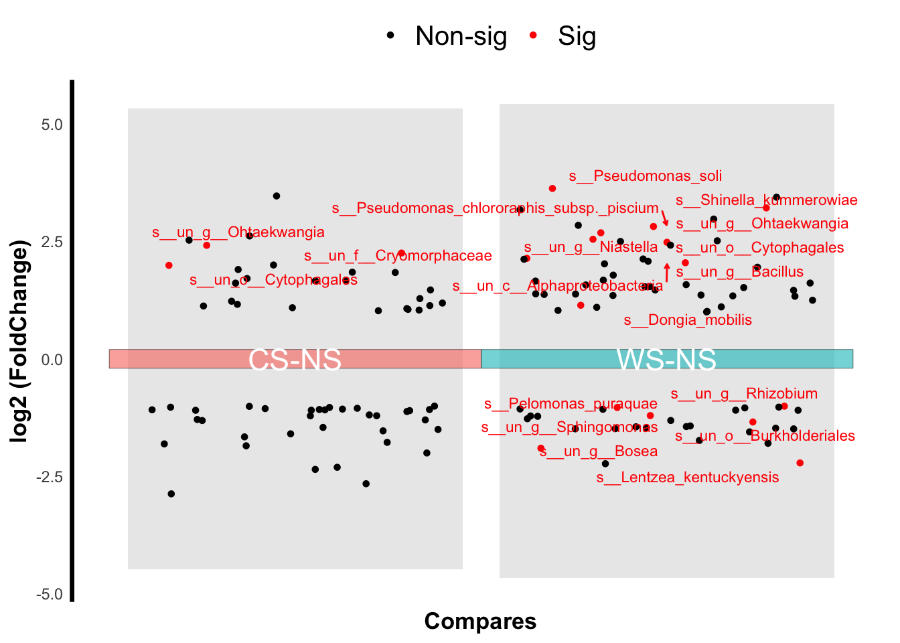
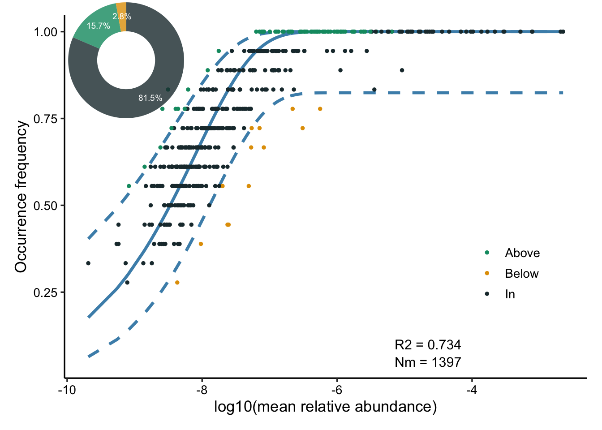
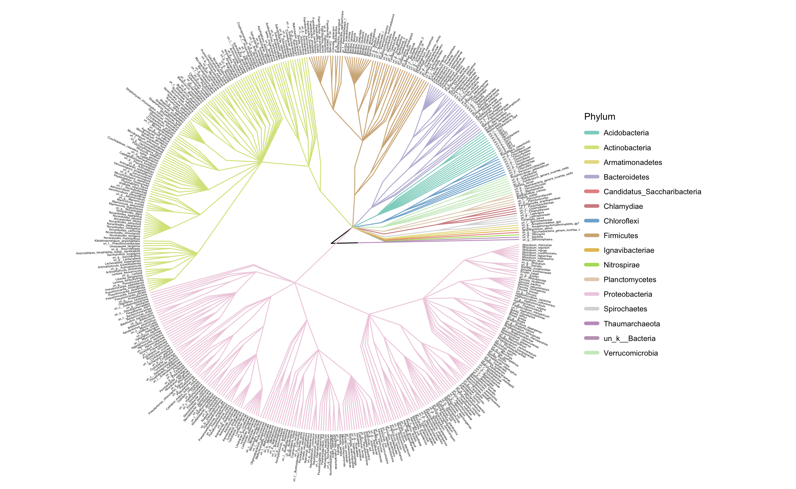

# pctax

`pctax` provides a comprehensive suite of tools for analyzing microbiome data.

## Install


```r
install.packages("devtools")
devtools::install_github('Asa12138/pcutils',dependencies=T)

devtools::install_github('Asa12138/pctax',dependencies=T)
```

## Usage
It includes functionalities for α-diversity analysis, β-diversity analysis, differential analysis, community assembly, visualization of phylogenetic tree and functional enrichment analysis... 

Look at the test data:

```r
library(pctax)
library(pcutils)
data(otutab,package = "pcutils")
#help(otutab)

head(otutab)
```

```
##                               NS1  NS2  NS3  NS4  NS5  NS6  WS1  WS2  WS3  WS4
## s__un_f__Thermomonosporaceae 1092 1920  810 1354 1064 1070 1252 1597 1330  941
## s__Pelomonas_puraquae        1962 1234 2362 2236 2903 1829  644  495 1230 1284
## s__Rhizobacter_bergeniae      588  458  889  901 1226  853  604  470 1070 1028
## s__Flavobacterium_terrae      244  234 1810  673 1445  491  318 1926 1493  995
## s__un_g__Rhizobacter         1432  412  533  759 1289  506  503  590  445  620
##                               WS5  WS6  CS1  CS2  CS3  CS4  CS5  CS6
## s__un_f__Thermomonosporaceae 1233 1011 2313 2518 1709 1975 1431 1527
## s__Pelomonas_puraquae         953  635 1305 1516  844 1128 1483 1174
## s__Rhizobacter_bergeniae      846  670 1029 1802 1002 1200 1194  762
## s__Flavobacterium_terrae      577  359 1080 1218  754  423 1032 1412
## s__un_g__Rhizobacter          657  429 1132 1447  550  583 1105  903
##  [ reached 'max' / getOption("max.print") -- omitted 1 rows ]
```

```r
head(metadata)
```

```
##      Id Group     env1     env2     env3      env4     env5        env6
## NS1 NS1    NS 3.057248 10.23571 5.554576  8.084997 25.00795 -1.15456682
## NS2 NS2    NS 4.830219 11.13453 5.613455  8.556829 16.67690  0.81168745
## NS3 NS3    NS 3.753133 10.06232 5.582916 10.226572 21.68926  1.40733211
## NS4 NS4    NS 4.262264 10.84401 5.258419  9.002256 24.81046  1.47805320
## NS5 NS5    NS 2.476135  7.52584 6.255314  9.357587 19.70553  0.05813095
## NS6 NS6    NS 5.131004 10.82761 5.180966  8.141506 18.39021 -1.70032569
##          lat     long
## NS1 38.72412 118.2493
## NS2 38.31086 115.2322
## NS3 36.82439 118.1361
## NS4 37.59774 117.1563
## NS5 35.94188 118.9504
## NS6 37.68713 116.2984
```

```r
head(taxonomy)
```

```
##                                  Kingdom            Phylum
## s__un_f__Thermomonosporaceae k__Bacteria p__Actinobacteria
## s__Pelomonas_puraquae        k__Bacteria p__Proteobacteria
## s__Rhizobacter_bergeniae     k__Bacteria p__Proteobacteria
## s__Flavobacterium_terrae     k__Bacteria  p__Bacteroidetes
## s__un_g__Rhizobacter         k__Bacteria p__Proteobacteria
## s__un_o__Burkholderiales     k__Bacteria p__Proteobacteria
##                                               Class               Order
## s__un_f__Thermomonosporaceae      c__Actinobacteria  o__Actinomycetales
## s__Pelomonas_puraquae         c__Betaproteobacteria  o__Burkholderiales
## s__Rhizobacter_bergeniae     c__Gammaproteobacteria  o__Pseudomonadales
## s__Flavobacterium_terrae          c__Flavobacteriia o__Flavobacteriales
## s__un_g__Rhizobacter         c__Gammaproteobacteria  o__Pseudomonadales
## s__un_o__Burkholderiales      c__Betaproteobacteria  o__Burkholderiales
##                                                Family
## s__un_f__Thermomonosporaceae   f__Thermomonosporaceae
## s__Pelomonas_puraquae               f__Comamonadaceae
## s__Rhizobacter_bergeniae          f__Pseudomonadaceae
## s__Flavobacterium_terrae         f__Flavobacteriaceae
## s__un_g__Rhizobacter              f__Pseudomonadaceae
## s__un_o__Burkholderiales     f__un_o__Burkholderiales
##                                                     Genus
## s__un_f__Thermomonosporaceae g__un_f__Thermomonosporaceae
## s__Pelomonas_puraquae                        g__Pelomonas
## s__Rhizobacter_bergeniae                   g__Rhizobacter
## s__Flavobacterium_terrae                g__Flavobacterium
## s__un_g__Rhizobacter                       g__Rhizobacter
## s__un_o__Burkholderiales         g__un_o__Burkholderiales
##                                                   Species
## s__un_f__Thermomonosporaceae s__un_f__Thermomonosporaceae
## s__Pelomonas_puraquae               s__Pelomonas_puraquae
## s__Rhizobacter_bergeniae         s__Rhizobacter_bergeniae
## s__Flavobacterium_terrae         s__Flavobacterium_terrae
## s__un_g__Rhizobacter                 s__un_g__Rhizobacter
## s__un_o__Burkholderiales         s__un_o__Burkholderiales
```

### α-diversity analysis

Calculate a_diversity of otutab then link to experiment group or environment variable.

```r
a_diversity(otutab)->a_res
plot(a_res,metadata,"Group")
```

<div class="figure">

<p class="caption">Figure 1: α-diversity</p>
</div>

```r
plot(a_res,metadata,"env1")
```

<div class="figure">

<p class="caption">Figure 2: α-diversity</p>
</div>

### β-diversity analysis

There are a range of dimensionality reduction methods available for analysis, including Constrained and non-Constrained.

Like PCA, PCoA, NMDS, RDA, CCA... For example:

PCA:

```r
b_analyse(otutab,method = "pca")->b_res
plot(b_res,"Group",metadata,bi = T,rate=0.5)
```

```
## $PCA
```

<div class="figure">

<p class="caption">Figure 3: PCA for β-diversity</p>
</div>

```r
plot(b_res,"Group",metadata,mode = 3)
```

```
## $PCA
```

<div class="figure">

<p class="caption">Figure 4: PCA for β-diversity</p>
</div>

RDA:

```r
env=metadata[,6:10]
#RDA
myRDA(otutab,env)->phy.rda
```

```
## 
## Call:
## vegan::decorana(veg = dat.h) 
## 
## Detrended correspondence analysis with 26 segments.
## Rescaling of axes with 4 iterations.
## Total inertia (scaled Chi-square): 0.3207 
## 
##                         DCA1    DCA2    DCA3    DCA4
## Eigenvalues          0.03127 0.02265 0.01916 0.01729
## Additive Eigenvalues 0.03127 0.02265 0.01917 0.01727
## Decorana values      0.03150 0.02146 0.01701 0.01035
## Axis lengths         0.74268 0.74498 0.57253 0.52361
## 
## DCA analysis, select the sorting analysis model according to the first value of the Axis lengths row
##    Axis Lengths >4.0-CCA (based on unimodal model, canonical correspondence analysis);
##    If it is between 3.0-4.0 - both RDA/CCA;
##    If less than 3.0-RDA (based on linear model, redundancy analysis)
## [1] "===============Initial Model================"
## [1] "Initial cca, vif>20 indicates serious collinearity:"
##     env4     env5     env6      lat     long 
## 2.671744 3.148860 1.161378 1.417139 1.120735 
## Initial Model R-square: 0.05504835 
## [1] "=============Statistics==========="
## 0.3329753 Constrained indicates the degree to which environmental factors explain differences in community structure
## 0.6670247 unconstrained means that the environmental factors cannot explain the part of the community structure
```

```r
RDA_plot(phy.rda,"Group",metadata)
```

<div class="figure">

<p class="caption">Figure 5: RDA for β-diversity associated environmental variables</p>
</div>


### Differential analysis

There are also lots of statistic methods for differential analysis:
ALDEX, ANCOM2, randomForest, t.test, wilcox.test... or deseq2, limma...(Commonly used in transcriptome)

```r
diff_da(otutab,metadata["Group"])->res
volcano_p(res)
```

<div class="figure">

<p class="caption">Figure 6: Volcano plot of differential analysis</p>
</div>

```r
volcano_p(res,mode=2)
```

<div class="figure">

<p class="caption">Figure 7: Volcano plot of differential analysis</p>
</div>

### Community assembly

Community assembly in microbiome refers to the processes that shape the composition, diversity, and structure of microbial communities in a particular environment or host. 
Microbiome consist of diverse microbial populations that interact with each other and their surroundings, and understanding how these communities assemble is crucial for comprehending their ecological dynamics and functional implications.


```r
ncm(otutab)->ncm_res
plot(ncm_res)
```

<div class="figure">

<p class="caption">Figure 8: NCM model</p>
</div>

### Phylogenetic tree

```r
ann_tree(taxonomy,otutab)->tree
easy_tree(tree,add_abundance=FALSE)
```

<div class="figure">

<p class="caption">Figure 9: Phylogenetic tree</p>
</div>

## Cite
Please cite:

Chen P (2023). _pctax: Professional Comprehensive Microbiome Data Analysis_. R package, <https://github.com/Asa12138/pctax>.
