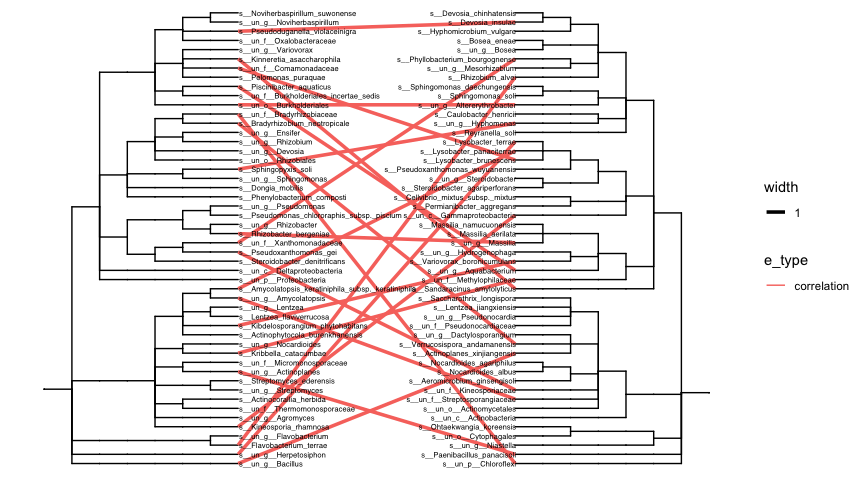

<!-- README.md is generated from README.Rmd. Please edit that file -->


# pctax 

<!-- badges: start -->

[](https://github.com/Asa12138/pctax/actions/workflows/R-CMD-check.yaml)
[](https://doi.org/waiting)
[](https://asa-blog.netlify.app/)
[](https://cran.r-project.org/package=pctax)
[](https://cran.r-project.org/package=pctax)
[](https://cran.r-project.org/package=pctax)
[](https://github.com/Asa12138/pctax)
<!-- badges: end -->

`pctax` provides a comprehensive suite of tools for analyzing omics
data.

## Installation

The stable version is available on CRAN:

    install.packages("pctax")

Or you can install the development version of pctax from
[GitHub](https://github.com/) with:

``` r
# install.packages("devtools")
devtools::install_github("Asa12138/pctax")
```

## 🚀 NEWS 🚀

Recently I added a function to plot element cycling because element
cycling genes are important in the microbiome (especially the
environmental microbiome). Supports simple cycle diagram drawing of C,
N, P, S, Fe (manual arrangement, there must be some missing parts, will
be continuously added in the future):

``` r
plot_element_cycle(cycle = "Nitrogen cycle")
#> recommend ggsave(width = 12,height = 10)
```

<div class="figure">


<p class="caption">
Nitrogen cycle
</p>

</div>

## Usage

For the full vignette, please visit [pctax: Analyzing Omics Data with
R](https://bookdown.org/Asa12138/pctax_book/).

**Some Functionalities of `pctax`:**


## Citation

Please cite:

Chen Peng, Chao Jiang (2023). *pctax: Professional Comprehensive
Microbiome Data Analysis Pipeline*. R package,
<https://github.com/Asa12138/pctax>.
