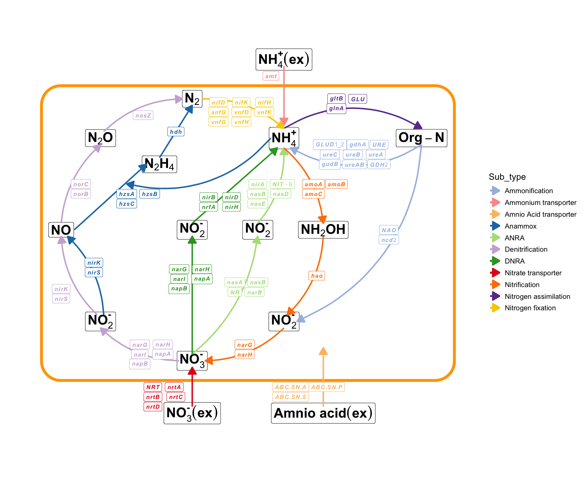
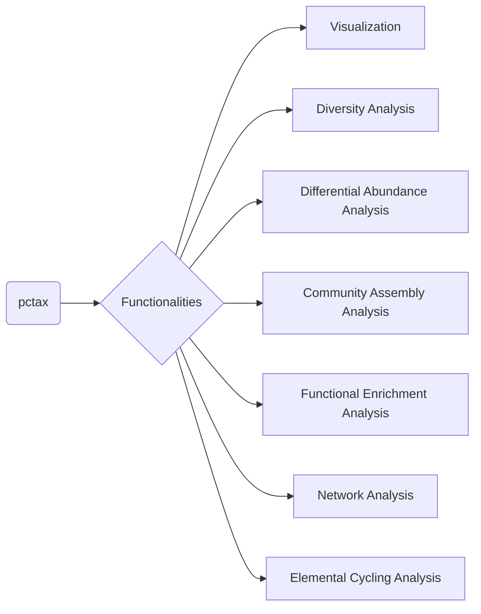

<!-- README.md is generated from README.qmd. Please edit that file -->
<!-- badges: start -->

[](https://asa-blog.netlify.app/)
[](https://cran.r-project.org/package=pctax)
[](https://cran.r-project.org/package=pctax)
[](https://cran.r-project.org/package=pctax)
[](https://github.com/Asa12138/pctax)

<!-- badges: end -->

# pctax

`pctax` provides a comprehensive suite of tools for analyzing omics
data.

## Install

``` r
install.packages("devtools")
devtools::install_github("Asa12138/pcutils")
devtools::install_github("Asa12138/pctax")
```

## 🚀 NEWS 🚀

Recently I added a function to plot element cycling because element
cycling genes are important in the microbiome (especially the
environmental microbiome). Supports simple cycle diagram drawing of C,
N, P, S, Fe (manual arrangement, there must be some missing parts, will
be continuously added in the future):

``` r
plot_element_cycle(cycle = "Nitrogen cycle")
#> Warning: Using `size` aesthetic for lines was deprecated in ggplot2 3.4.0.
#> ℹ Please use `linewidth` instead.
#> ℹ The deprecated feature was likely used in the pctax package.
#>   Please report the issue at <https://github.com/Asa12138/pctax/issues>.
#> recommend ggsave(width = 12,height = 10)
```



## Usage

For the full vignette, please visit [pctax: Analyzing Omics Data with
R](https://bookdown.org/Asa12138/pctax_book/).

**Some Functionalities of `pctax`:**



## Citation

Please cite:

Chen Peng, Chao Jiang (2023). *pctax: Professional Comprehensive
Microbiome Data Analysis Pipeline*. R package,
<https://github.com/Asa12138/pctax>.
